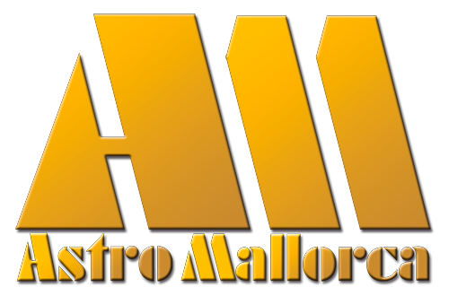

[](https://casalsdebarri.cat/casals/cb-santa-catalina/)
[](https://astromallorca.wordpress.com/)
## Sep. 07 a dic. 16 de 2021 ([Casal de Santa Catalina](https://casalsdebarri.cat/casals/cb-santa-catalina/))
## Docente: [Ernesto Nicola](bio.md) ([AstroMallorca](https://astromallorca.wordpress.com/))
## Descripción del curso
Curso de astronomía a nivel introductorio que hará un recorrido por las áreas más relevantes de esta ciencia. ¡En el curso no solo aprenderás a reconocer las constelaciones y los objetos más destacables del cielo, sino que también descubrirás cómo está formado y cómo funciona nuestro Universo! 
```
El curso discutirá los siguientes temas:
1. Introducción al curso
2. Una breve Historia de la Astronomía
3. Esfera Celeste: Movimientos, Coordenadas, Constelaciones, etc.
4. Instrumentos Ópticos en Astronomía
5. Astronomía del Sistema Solar
6. Astronomía de los Objetos del Cielo Profundo
7. Astronomía de la Vía Láctea y Galáctica
8. Cosmología
```
## Duración del curso
* Curso de 22h; divididas en 11 clases de 2h cada una
* Las clases serán todos los jueves de 19 a 21h
* El curso empieza el 7 de oct. y termina el 16 de dic. 2021

## [Programa del curso](programa.md)[^1]
_A continuación encontrarás una versión resumida del programa del curso, en este enlace hay un [programa detallado](programa.md).
¡El programa puede cambiar sin previo aviso!_

### 07-10-2021: _Presentación e Historia de la Astronomía_
* Presentación del Curso
* Breve Historia de la Astronomía

### 14-10-2021: _Observación Astronómica 1_
* La Esfera Celeste

### 21-10-2021: _Observación Astronómica 2_
* Mapas y Objetos Celestes
* Instrumentos Ópticos

### 28-10-2021: _Sistema Solar 1_
* Introducción al Sistema Solar
* Planetas y sus Lunas

### 04-11-2021: _Sistema Solar 2_
* Asteroides, Cometas y Meteoros

### 11-11-2021: _Sistema Solar 3_
* La Luna, nuestro Satélite

### 18-11-2021: _Sistema Solar 4_
* El Sol, nuestra Estrella

### 25-11-2021: _Astronomía Estelar_
* Estrellas 
* Cúmulos Estelares y Nebulosas

### 02-12-2021: _Astronomía Galáctica_
* Vía Láctea y Galaxias

### 09-12-2021: _Cosmología 1_
* El Universo: Composición

### 16-12-2021: _Cosmología 2_
* El Universo: Cosmología y Evolución del Universo

## [Bibliografía del curso](bibliografía.md)

[^1]: página actualizada por última vez el: 2021-12-16
